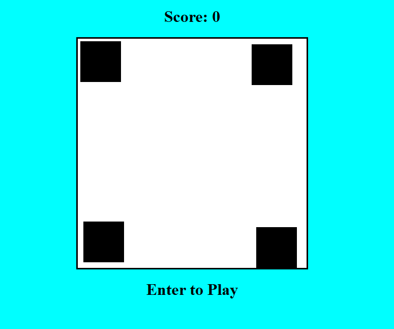

# Dodge The Enemy Game

A simple web-based game where you control a red ball and try to survive as long as possible by avoiding moving obstacles.

## How to Play
- Move your red ball with the mouse inside the white container.
- Avoid all black enemy blocks.
- Leaving the white area or touching the wall resets your score to 0.
- Your current score is displayed at the top.
- If you collide with an enemy, the game is over.

## Features
- Real-time scoring
- Collision detection
- Game over handling
- Instructions for new players

## License
This project is free to use and modify.
